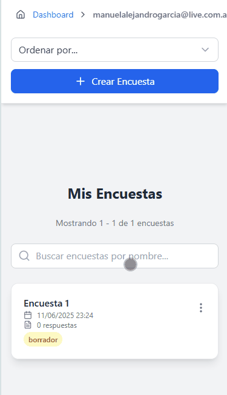

<!-- 
====================================================================================================
¡Hola! 👋 Bienvenido al código de mi perfil.
Hecho con cariño para impresionar. ¡Siéntete libre de tomar inspiración!
====================================================================================================
-->

<!-- INTRODUCCIÓN -->

  <h1>¡Hola! 👋 Soy Manuel García</h1>
  <h3>Desarrollador Full Stack especializado en TypeScript, NestJS y Angular</h3>
  
Transformo ideas complejas en soluciones de software elegantes y eficientes. Apasionado por el backend robusto, el frontend interactivo y el código limpio.

  

---

<!-- STACK TECNOLÓGICO -->
<h2 align="center">🚀 Mi Stack Tecnológico Principal</h2>

  Estas son las tecnologías con las que más trabajo y construyo mis proyectos actualmente.

  
  
  
  
  
  
  

  
⚙️ Ver más herramientas y tecnologías

  

    <b>Backend:</b> Express, JWT, Bcrypt, Nodemailer, Node-Cache, Swagger  
    <b>Frontend:</b> React, JavaScript (ES6+)  
    <b>Bases de Datos:</b> PostgreSQL, MySQL   
    <b>Caché y Optimización:</b> Redis, Node-Cache   
    <b>Herramientas y DevOps:</b> Git, GitHub, PNPM, PM2, NGINX, VS Code
  

 

---

<!-- PROYECTO DESTACADO -->
<h2 align="center">🏆 Proyecto Destacado 🏆</h2>
<table width="100%">
  <tr>
    <td width="65%" valign="top">
      <h3>🔐 Sistema de Encuestas Anónimas</h3>
      
Plataforma full-stack que garantiza la privacidad de los participantes, permitiendo a los creadores gestionar encuestas y visualizar resultados agregados sin comprometer la identidad de los votantes.

      <h4>✨ <strong>Características Principales:</strong></h4>
      <ul>
        <li><b>Creación y Gestión:</b> Interfaz intuitiva para crear, publicar y editar encuestas.</li>
        <li><b>Acceso sin Login:</b> El creador accede a su dashboard a través de un enlace único y seguro enviado por email.</li>
        <li><b>Anonimato Garantizado:</b> El sistema está diseñado para no almacenar ni mostrar datos individuales de los votos.</li>
        <li><b>Documentación de API:</b> API documentada con Swagger para una fácil integración y prueba.</li>
      </ul>
      <h4>🛠️ <strong>Stack Tecnológico:</strong></h4>
      

        <code>TypeScript</code> <code>NestJS</code> <code>Angular</code> <code>PostgreSQL</code> <code>TypeORM</code> <code>TailwindCSS</code> <code>Nodemailer</code> <code>Swagger</code>
      

      
      <!-- Si tienes una demo en vivo, ¡descomenta y usa este! -->
      <!--
      
      -->
    </td>
    <td width="35%" valign="top">
      <!-- ¡SUPER IMPORTANTE! Graba un GIF corto de tu app y ponlo aquí -->
      <!-- Puedes usar herramientas como ScreenToGif (Windows) o Kap (Mac) -->
      
    </td>
  </tr>
</table>

---

<!-- OTROS PROYECTOS -->

  
📂 Ver otros proyectos

   
  <table>
    <tr>
      <td valign="top" width="50%">
        <h4>🛠️ API con Node.js</h4>
        
Backend modular con Express, JWT, envío de emails, PDF, CSV y caché con Redis.

        <a href="https://github.com/Manuelgarcia1/API-NodeJS" target="_blank">Ver Repositorio</a>
      </td>
      <td valign="top" width="50%">
        <h4>🌱 Ferias del Centro</h4>
        
Página institucional para empresa ganadera, desarrollada con React y optimizada para SEO.

        <a href="https://github.com/Manuelgarcia1/ferias-del-centro" target="_blank">Ver Repositorio</a>
      </td>
    </tr>
  </table>

 

---

<!-- CONTACTO -->

  <h2>📫 Hablemos</h2>
  
Estoy abierto a nuevas oportunidades laborales y colaboraciones emocionantes. ¡No dudes en contactarme!

  

<!-- FOOTER -->

  

